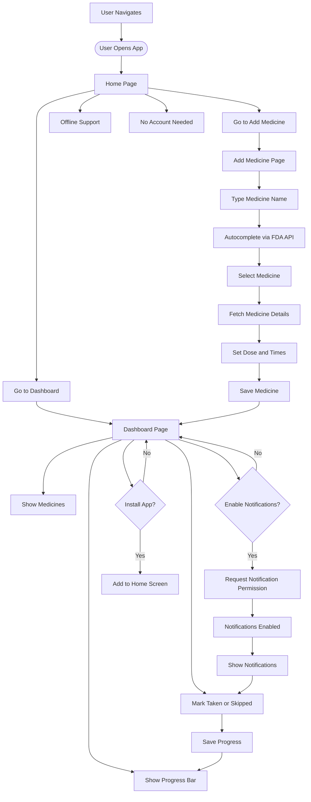

# 🎯 MediTrack – Medicine Reminder App

[**Live Demo → meditrack-by-saket.netlify.app**](https://meditrack-by-saket.netlify.app/)

---

## 🗺️ Workflow Diagram



---

## 🔥 Why MediTrack?

**MediTrack** is a privacy-first, user-friendly web app that helps you remember to take your medicines on time and track your intake—ideal for patients, elderly, caregivers, or anyone on a daily medicine schedule.  
It solves a real-world healthcare problem: medication adherence, which is critical for health but often overlooked.

---

## 🛠️ Tech Stack

- **Frontend:** React.js (with Hooks & React Router)
- **API Integration:** [FDA Drug Label API](https://open.fda.gov/apis/drug/drug-label/)
- **Data Storage:** Browser LocalStorage (no accounts needed)
- **Notifications:** Browser Notification API (works on desktop & mobile)
- **Styling:** Tailwind CSS (using Arial/sans-serif for accessibility)
- **PWA:** Installable to your phone, works offline

---

## 🌐 Key Features

### 🏠 Home Page

- Welcomes you with an introduction to MediTrack
- Quick navigation to Dashboard and Add Medicine

### 📅 Dashboard

- **See All Medicines:**  
  Lists every medicine, its schedule, and today's progress (taken/skipped/upcoming)
- **Visual Progress Bar:**  
  Shows your daily adherence at a glance
- **One-tap Status Update:**  
  Mark medicines as taken or skipped

### ➕ Add Medicine

- **Smart Autocomplete:**  
  Start typing a medicine name – get live suggestions from the FDA Drug Label API (brand & generic names)
- **Fetches Details:**  
  Pulls dosage, description, and manufacturer info from FDA when available
- **Schedule Times:**  
  Choose from common medicine times (e.g., 8AM, 1PM, 6PM)
- **Easy Data Entry:**  
  Dosage, name, and schedule in a clean, simple form

### 🔔 Notifications

- **Timely Reminders:**  
  Browser notifications pop up at your chosen medicine times
- **Works Offline / Installed:**  
  After installation, reminders fire even if the app is closed
- **Permission Flow:**  
  On Dashboard, click “Enable Now” and allow notifications in your browser

### 📱 Installable App (PWA)

- **Add to Home Screen:**  
  - On Android: Chrome shows “Add to Home Screen” or use menu → Install App  
  - On iOS: Safari → Share → Add to Home Screen
- **Offline Support:**  
  View your schedule and get reminders even when offline

### 🛡️ Privacy-First

- **No Account Needed:**  
  All data is stored locally in your browser
- **No Ads, No Tracking**

---

## 🎨 Design

- **Color Palette:**  
  - Blue (#4A90E2): Primary, medical trust  
  - Green (#2ECC71): Success, taken  
  - Yellow (#F4D03F): Missed/skipped  
  - Red (#E74C3C): Alert, overdue
- **Font:**  
  - Clean, accessible Arial/sans-serif everywhere for maximum readability
- **Layout:**  
  - Responsive, mobile-first design  
  - Rounded cards, soft shadows, clear hierarchy

---

## 📡 FDA Drug API: Where & How

- **Autocomplete:**  
  When typing a medicine name in the “Add Medicine” form, the app:
  1. Waits for 3+ characters
  2. Searches both `openfda.brand_name` and `openfda.generic_name` fields via:
      ```
      https://api.fda.gov/drug/label.json?search=openfda.brand_name:<query>&limit=5
      https://api.fda.gov/drug/label.json?search=openfda.generic_name:<query>&limit=5
      ```
  3. Merges and deduplicates results for suggestions
- **Details Fetch:**  
  On medicine selection, fetches and saves:
  - **Description**
  - **Dosage**
  - **Manufacturer**

---

## 🚦 How To Use

1. **Visit the App:**  
   [https://meditrack-by-saket.netlify.app/](https://meditrack-by-saket.netlify.app/)
2. **Enable Notifications:**  
   - On Dashboard, click “Enable Now” in the banner
   - Allow notification permission in your browser
3. **Add Medicines:**  
   - Go to Add Medicine
   - Start typing the name, select from suggestions, set dosage/schedule
   - Save
4. **Get Reminders:**  
   - You’ll receive notifications at scheduled times (works offline/installed)
5. **Install the App:**  
   - Android/Chrome: “Add to Home Screen” prompt or menu  
   - iOS/Safari: Share → Add to Home Screen

---

## 🗂️ Project Structure

```
├── public/
│   ├── index.html
│   ├── manifest.json
│   ├── serviceWorker.js
│   ├── icons/ (PWA icons)
├── src/
│   ├── components/
│   │   ├── Navbar.jsx
│   │   ├── Footer.jsx
│   │   ├── MedicineCard.jsx
│   │   ├── MedicineSearch.jsx
│   │   └── ProgressSummary.jsx
│   ├── pages/
│   │   ├── Home.jsx
│   │   ├── Dashboard.jsx
│   │   ├── AddMedicine.jsx
│   │   └── NotFound.jsx
│   ├── utils/
│   │   ├── apiService.js
│   │   ├── localStorage.js
│   │   └── notifications.js
│   ├── index.css
│   └── main.jsx
├── tailwind.config.js
├── package.json
└── README.md
```

---

## 💡 Developer Notes

- **Run Locally:**
  ```bash
  npm install
  npm run dev
  ```
- **Test Notifications:**  
  - Add a medicine, schedule for a time a minute ahead, ensure notifications permission is granted.
- **Icons:**  
  - Place your PNG icons (192x192, 512x512) in `/public/icons` for best install experience.

---

## 🙏 Credits

- **API Data:** [FDA OpenFDA Drug Label API](https://open.fda.gov/apis/drug/drug-label/)
- **Icons:** [Icons8](https://icons8.com/) / Custom

---

## ⭐ Try It Now!

**Track your medicines, never miss a dose! → [https://meditrack-by-saket.netlify.app/](https://meditrack-by-saket.netlify.app/)**

---

> _MediTrack: Your friendly, private, and smart medicine assistant._
